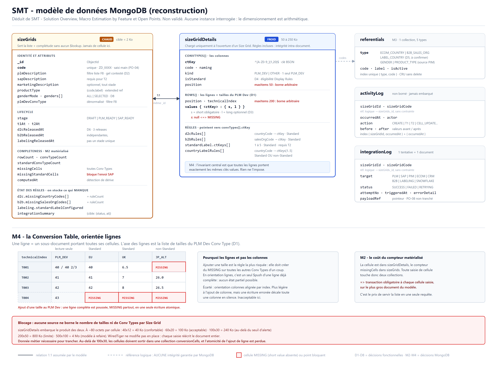

# Claude Code ideation

> Page destinée à l'espace Confluence SMT, sous `Data Model ideation`
> (<https://amersports.atlassian.net/wiki/spaces/SMT/pages/1597735187/Data+Model+ideation>).
> Contenu prêt à coller dans l'éditeur Confluence Cloud.
> Schéma d'accompagnement : `claude-code-ideation-schema.png`, à joindre en tête de page.



## Provenance et statut

Cette page est une **reconstruction** produite par Claude Code, déduite des sources suivantes :

- `SMT - Solution Overview` (prose fonctionnelle : cycle de vie T1/T2/T3, Size Grid, Conversion
  Table, Display Rules, Label Rules, bus de messages)
- `SMT - Macro Estimation by Feature` (découpage F0 à F9)
- `Open Points` (PO-01 à PO-10)
- le code de `sln-smt-backend`, qui à ce jour n'expose que `GET /v1/echo` et ne contient aucune
  entité ni schéma

Elle n'est **pas validée**. Les pages sources portent l'avertissement « study purposes only, not a
source of truth ». Rien ici ne doit servir de base à un développement en l'état.

Aucune instance MongoDB n'a été interrogée : tout le dimensionnement est de l'arithmétique sur des
hypothèses de volume explicites, pas de la mesure.

## Décisions fonctionnelles préalables (D1 à D8)

Ces huit points sont des trous ou des contradictions relevés dans les specs. Le modèle en dépend,
donc ils sont tranchés explicitement ici. Ce sont eux qu'il faut confronter en priorité.

| # | Trou | Décision retenue | Pourquoi |
|---|---|---|---|
| D1 | Cardinalité du cœur | **L'axe des lignes est la liste de tailles du PLM Dev Conv Type.** Toute autre Conv Type a exactement une cellule par ligne. | « Adding a new size to the PLM Development Size Conv Type **creates a new row**, immediately MISSING on all other Conv Types » ne se lit pas autrement. La « size list with order » d'une Conv Type est matérialisée par sa colonne de cellules. |
| D2 | `PLM Description` gelée après T1 ? | **Non gelée** ; seuls `code`, `gender`, `product_type` le sont. | PO-10 est BLOCKING. Ne pas coder une contrainte contestée. À trancher. |
| D3 | « 2 length values » vs « short / long » | **Même notion.** `short` + `long` sur la cellule. | Aucune source ne les distingue. |
| D4 | Nature « Standard » | **Booléen porté par la Conv Type**, posé à la création. | Rien ne décrit de mécanisme central, et « no central registry » l'exclut. |
| D5 | Pays des Label Rules | **Référentiel distinct** `LABEL_COUNTRY`. | F1.1 liste « Label Countries » séparément des « D2C countries ». À confirmer : si c'est le même que `ECOM_COUNTRY`, supprimer le type. |
| D6 | Cycle de vie | **Stade scalaire (T1/T2) + 3 booléens de release indépendants.** | T3 est décrit comme 3 releases indépendantes. |
| D7 | Attributs obligatoires à T1 | Limités à ce qui est documenté. | PO-05 OPEN. La liste est à compléter. |
| D8 | `Gender` multivalué | **Tableau** + mode `ALL` / `SELECTED`. | PO-01 CLOSED retient « All genders » ou multi-select. |

## Ce que MongoDB change

**M1 - Le modèle suit les accès, pas les entités.** Deux accès dominent et s'opposent :

| Accès | Fréquence | Données nécessaires | Volume par Size Grid |
|---|---|---|---|
| Liste des Size Grids + complétude (dashboard F8, tous rôles) | très élevée | identité, stade, compteurs, flags | ~1,5 Ko |
| Détail d'un Size Grid + Conversion Table complète | modérée | tout, dont les cellules | 50 à 250 Ko |

En relationnel, une jointure réglait ça. Ici, tout embarquer dans un document unique ferait charger
250 Ko par ligne de liste. D'où un **découpage hot / cold en 1:1** : `sizeGrids` (chaud) et
`sizeGridDetails` (froid). Le split 1:1 est normalement un anti-pattern, mais les trois critères
d'exception sont réunis : écart de taille extrême, fréquences de mise à jour différentes, accès
indépendants.

**M2 - Les compteurs de complétude deviennent stockés, plus dérivés.** La décision D6 (« flags
`Incomplete` dérivés, jamais stockés ») ne survit pas. Une vue équivalente exigerait un `$lookup` +
agrégation sur chaque ligne de liste. Le pattern Computed impose de matérialiser les compteurs sur
`sizeGrids` et de les maintenir à l'écriture. **Contre-décision assumée**, avec son coût : voir
« Écritures notables ».

**M3 - Les 5 référentiels deviennent une seule collection.** Genre, type produit, pays Ecom, sales
org B2B et pays d'étiquetage sont des données homogènes (code, libellé, actif). Cinq collections pour
ça est un anti-pattern MongoDB. Une collection `referentials` avec discriminant `type` (pattern
Polymorphic).

**M4 - La matrice est orientée lignes, clés dynamiques par Conv Type.** Le choix structurant. Trois
formes possibles ; on retient « lignes portant une map ctKey -> cellule », parce qu'elle rend la
règle métier la plus risquée (ajout d'une taille au PLM Dev, qui doit créer du MISSING partout)
atomique en une seule écriture, sans état partiel possible. L'alternative écartée est discutée en
fin de page.

**M5 - Contrainte nouvelle : les bornes de la matrice ne sont pas spécifiées.** C'est le point de
blocage réel, détaillé en fin de page.

## Collections

### sizeGrids - document chaud

Sert la liste sans aucun `$lookup`. Cible : rester sous 2 Ko. Ne jamais y embarquer de cellule.

```javascript
{
  _id: ObjectId("..."),
  code: "ZD_0142",                        // unique, saisi main (PO-04)
  plmDescription: "Chaussure running homme",
  marketingDescription: null,             // optionnel, tout stade
  sapDescription: "RUN M",                // requis pour T2, sinon null

  productType: { code: "FOOTWEAR", label: "Footwear" },   // extended reference
  genderMode: "SELECTED",                                  // "ALL" | "SELECTED"
  genders: [{ code: "M", label: "Men" }],                  // vide si ALL  (D8)

  // Conv Type de sourcing, dénormalisée : la liste filtre dessus (F8)
  plmDevConvType: { key: "PLM_DEV", code: "PLMDEV_EU", naming: "PLM Development Size" },

  lifecycle: {
    stage: "SAP_READY",                   // "DRAFT" | "PLM_READY" | "SAP_READY"
    t1At: ISODate("2026-07-02T09:14:00Z"),
    t2At: ISODate("2026-07-15T16:02:00Z"),
    d2cReleasedAt: null,                  // D6 : 3 releases indépendantes
    b2bReleasedAt: null,
    labelingReleasedAt: null
  },

  // M2 : compteurs matérialisés. Maintenus à l'écriture, jamais recalculés en lecture.
  completeness: {
    rowCount: 38,
    convTypeCount: 11,
    standardConvTypeCount: 8,
    missingCells: 14,                     // toutes Conv Types
    missingStandardCells: 3,              // ce qui bloque l'envoi SAP
    computedAt: ISODate("2026-07-29T11:04:00Z")
  },

  // Complétude des Display Rules : on stocke ce qui MANQUE, pas un booléen.
  // Ajout d'un pays au référentiel = un seul updateMany $addToSet. Et le
  // dashboard affiche quel pays manque, pas juste "incomplet".
  d2c: { ruleCount: 47, missingCountryCodes: ["PL", "CZ"] },
  b2b: { ruleCount: 22, missingSalesOrgCodes: [] },
  labeling: { countryRuleCount: 12, standardLabelConfigured: true },

  // Dernier état d'intégration par cible, pour la liste (F8)
  integrationSummary: {
    PLM:       { status: "SUCCESS", at: ISODate("2026-07-02T09:14:12Z") },
    SAP:       { status: "FAILED",  at: ISODate("2026-07-15T16:03:01Z"), attempts: 3 },
    SNOWFLAKE: { status: "SUCCESS", at: ISODate("2026-07-15T16:02:40Z") }
  },

  createdAt: ISODate("..."), createdBy: "u.mdt1",
  updatedAt: ISODate("..."), updatedBy: "u.mdt2",
  schemaVersion: 1                        // pattern Schema Versioning
}
```

### sizeGridDetails - document froid

`_id` = `_id` du sizeGrid (1:1). Chargé uniquement à l'ouverture d'un Size Grid. Porte la Conversion
Table **et** les règles, parce que les règles référencent des Conv Types : l'intégrité reste
intra-document.

```javascript
{
  _id: ObjectId("..."),                   // == sizeGrids._id

  // --- Colonnes ---
  // ctKey : slug stable ^[A-Z0-9_]{1,20}$, généré à la création.
  // Sert de clé BSON dans rows[].values : d'où le format contraint
  // (pas de point, pas de $). Le "code" métier reste libre.
  convTypes: [
    { ctKey: "PLM_DEV", code: "PLMDEV_EU", naming: "PLM Development Size",
      kind: "PLM_DEV", isStandard: false, position: 0, createdAt: ISODate("...") },
    { ctKey: "EU",  code: "STD_EU",  naming: "EU",  kind: "OTHER",
      isStandard: true,  position: 1, createdAt: ISODate("...") },
    { ctKey: "UK",  code: "STD_UK",  naming: "UK",  kind: "OTHER",
      isStandard: true,  position: 2, createdAt: ISODate("...") },
    { ctKey: "JP_ALT", code: "NSTD_JP", naming: "JP alternatif", kind: "OTHER",
      isStandard: false, position: 3, createdAt: ISODate("...") }
  ],

  // --- Lignes (D1 : l'axe est la liste de tailles du PLM Dev) ---
  // Une ligne porte toutes ses cellules. s = short (obligatoire),
  // l = long (optionnel). s: null  <=>  MISSING.
  rows: [
    { position: 0, technicalIndex: "T001",
      values: {
        PLM_DEV: { s: "40",   l: "40 2/3" },
        EU:      { s: "40",   l: null },
        UK:      { s: "6.5",  l: null },
        JP_ALT:  { s: null,   l: null }        // MISSING
      }
    },
    { position: 1, technicalIndex: "T002",
      values: {
        PLM_DEV: { s: "41",   l: null },
        EU:      { s: "41",   l: null },
        UK:      { s: "7",    l: null },
        JP_ALT:  { s: "26.0", l: null }
      }
    }
  ],

  // --- Display Rules : le mapping réel. L'état de complétude est sur sizeGrids. ---
  d2cRules: [                             // Ecom Country -> 1 Conv Type Standard
    { countryCode: "FR", ctKey: "EU", updatedAt: ISODate("...") },
    { countryCode: "GB", ctKey: "UK", updatedAt: ISODate("...") }
  ],
  b2bRules: [                             // B2B Sales Org -> 1 Conv Type Standard
    { salesOrgCode: "FR01", ctKey: "EU", updatedAt: ISODate("...") }
  ],

  // --- Label Rules ---
  standardLabel: {                        // 1 à 5 Conv Types Standard, requis avant T2
    ctKeys: ["EU", "UK"],
    updatedAt: ISODate("...")
  },
  countryLabelRules: [                    // override par pays, Standard OU non
    { countryCode: "JP", ctKeys: ["EU", "JP_ALT"], updatedAt: ISODate("...") }
  ],

  schemaVersion: 1
}
```

### referentials - M3 : une collection, discriminant `type`

```javascript
{ _id: ObjectId("..."), type: "ECOM_COUNTRY",  code: "FR",   label: "France",
  isActive: true, createdAt: ISODate("...") }
{ _id: ObjectId("..."), type: "B2B_SALES_ORG", code: "FR01", label: "France Wholesale",
  isActive: true, createdAt: ISODate("...") }
{ _id: ObjectId("..."), type: "LABEL_COUNTRY", code: "JP",   label: "Japan",
  isActive: true }                                             // D5, à confirmer
{ _id: ObjectId("..."), type: "GENDER",        code: "M",    label: "Men",
  isActive: true, syncedAt: ISODate("..."), source: "PIM" }
{ _id: ObjectId("..."), type: "PRODUCT_TYPE",  code: "FOOTWEAR", label: "Footwear",
  isActive: true, syncedAt: ISODate("..."), source: "PIM" }
```

### activityLog

Non borné, **jamais embarqué**. Un document par action.

```javascript
{
  _id: ObjectId("..."),
  sizeGridId: ObjectId("..."),
  sizeGridCode: "ZD_0142",                // dénormalisé : évite un $lookup en vue globale
  occurredAt: ISODate("2026-07-29T10:12:03Z"),
  actor: "u.mdt2",
  action: "CELL_UPDATE",                  // CREATE | UPDATE | T1 | T2 | RELEASE_D2C | CONV_TYPE_ADD | ...
  target: { entity: "conversionCell", ctKey: "JP_ALT", rowPosition: 4 },
  before: { s: null, l: null },
  after:  { s: "26.5", l: null }
}
```

### integrationLog

Une tentative = un document (pas d'écrasement).

```javascript
{
  _id: ObjectId("..."),
  sizeGridId: ObjectId("..."),
  sizeGridCode: "ZD_0142",
  target: "SAP",                          // PLM|SAP|PIM|ECOM|CRM|B2B|LABELING|SNOWFLAKE
  status: "FAILED",                       // SUCCESS | FAILED | RETRYING
  attemptNo: 3,
  triggeredAt: ISODate("..."), completedAt: ISODate("..."),
  correlationId: "msg-9f2c...",
  errorDetail: "Timeout on bus topic sap.sizegrid.v1",
  payloadRef: "s3://smt-payloads/2026/07/15/msg-9f2c.json"   // pointeur, pas le payload
}
```

## Index

Volontairement minimal - chaque index non utilisé coûte à l'écriture. À revalider sur les requêtes
réelles.

```javascript
db.sizeGrids.createIndex({ code: 1 }, { unique: true })
db.sizeGrids.createIndex({ "lifecycle.stage": 1, "completeness.missingStandardCells": 1 })
db.sizeGrids.createIndex({ "plmDevConvType.naming": 1 })      // filtre F8
db.sizeGrids.createIndex({ "genders.code": 1 })
db.sizeGrids.createIndex({ updatedAt: -1 })                    // tri par défaut probable

db.referentials.createIndex({ type: 1, code: 1 }, { unique: true })
db.referentials.createIndex({ type: 1, isActive: 1 })

db.activityLog.createIndex({ sizeGridId: 1, occurredAt: -1 })
db.activityLog.createIndex({ occurredAt: -1 })                 // vue globale Admin/MDT

db.integrationLog.createIndex({ sizeGridId: 1, target: 1, triggeredAt: -1 })
db.integrationLog.createIndex({ status: 1, triggeredAt: -1 })   // console d'erreurs + retry
```

`sizeGridDetails` : aucun index au-delà de `_id`. Il n'est jamais interrogé autrement que par
identifiant.

**Filtre sur `plmDescription`** : le spec F8 demande un filtre sur ce champ. Si c'est du « contient »,
un index B-tree ne sert à rien (une regex non ancrée ne peut pas l'utiliser). Il faut soit un index
texte, soit Atlas Search. À arbitrer selon le volume de Size Grids - non chiffré dans les specs.

## Validation de schéma

Le point critique, parce que MongoDB ne donnera aucune des garanties qu'un DDL relationnel portait.
Voici les deux validateurs qui comptent le plus.

```javascript
db.createCollection("sizeGrids", {
  validator: { $jsonSchema: {
    bsonType: "object",
    required: ["code", "plmDescription", "productType", "genderMode", "lifecycle", "completeness"],
    properties: {
      code: { bsonType: "string", pattern: "^ZD_[0-9A-Z]{4}$" },   // format à confirmer
      genderMode: { enum: ["ALL", "SELECTED"] },
      genders: { bsonType: "array", maxItems: 20 },
      lifecycle: { bsonType: "object", required: ["stage"], properties: {
        stage: { enum: ["DRAFT", "PLM_READY", "SAP_READY"] } } },
      completeness: { bsonType: "object",
        required: ["missingCells", "missingStandardCells"], properties: {
          missingCells:         { bsonType: "int", minimum: 0 },
          missingStandardCells: { bsonType: "int", minimum: 0 } } },
      d2c: { bsonType: "object", properties: {
        missingCountryCodes: { bsonType: "array", maxItems: 500 } } }
    }
  }},
  validationLevel: "strict", validationAction: "error"
})

db.createCollection("sizeGridDetails", {
  validator: { $jsonSchema: {
    bsonType: "object",
    required: ["convTypes", "rows"],
    properties: {
      convTypes: {
        bsonType: "array",
        maxItems: 50,                      // BORNE ARBITRAIRE - voir blocage en fin de page
        items: { bsonType: "object",
          required: ["ctKey", "code", "naming", "kind", "isStandard", "position"],
          properties: {
            ctKey:      { bsonType: "string", pattern: "^[A-Z0-9_]{1,20}$" },
            kind:       { enum: ["PLM_DEV", "OTHER"] },
            isStandard: { bsonType: "bool" } } }
      },
      rows: {
        bsonType: "array",
        maxItems: 200,                     // BORNE ARBITRAIRE
        items: { bsonType: "object",
          required: ["position", "technicalIndex", "values"],
          properties: {
            technicalIndex: { bsonType: "string" },
            values: { bsonType: "object",
              additionalProperties: { bsonType: "object", properties: {
                s: { bsonType: ["string", "null"] },
                l: { bsonType: ["string", "null"] } } } } } }
      },
      standardLabel: { bsonType: "object", properties: {
        ctKeys: { bsonType: "array", minItems: 1, maxItems: 5 } } },
      countryLabelRules: { bsonType: "array", items: { bsonType: "object",
        properties: { ctKeys: { bsonType: "array", minItems: 1, maxItems: 5 } } } }
    }
  }},
  validationLevel: "strict", validationAction: "error"
})
```

Les `maxItems` sur `convTypes` et `rows` sont **arbitraires**, faute de borne spécifiée. C'est
exactement le blocage de fin de page.

## Écritures notables

Ce sont les opérations où le modèle se joue. Le reste est trivial.

### Ajouter une taille au PLM Dev

La règle métier la plus risquée (spec : « creates a new row, immediately MISSING on all other Conv
Types »). En pipeline update, donc côté serveur, atomique, sans lecture préalable, alignement
garanti par construction :

```javascript
db.sizeGridDetails.updateOne({ _id: gid }, [
  { $set: {
      rows: { $concatArrays: ["$rows", [{
        position: { $size: "$rows" },
        technicalIndex: newTechnicalIndex,
        values: { $arrayToObject: { $map: {
          input: "$convTypes", as: "ct",
          in: { k: "$$ct.ctKey", v: { $cond: [
            { $eq: ["$$ct.kind", "PLM_DEV"] },
            { s: newShort, l: newLong },      // la colonne PLM Dev est renseignée
            { s: null,     l: null }          // toutes les autres : MISSING
          ]}}
        }}}
      }]]
  }}
])
```

### Ajouter une Conv Type

Symétrique, une colonne sur toutes les lignes :

```javascript
db.sizeGridDetails.updateOne({ _id: gid }, [
  { $set: {
      convTypes: { $concatArrays: ["$convTypes", [newConvType]] },
      rows: { $map: { input: "$rows", as: "r", in: { $mergeObjects: ["$$r",
        { values: { $mergeObjects: ["$$r.values",
            { $arrayToObject: [[{ k: newConvType.ctKey, v: { s: null, l: null } }]] }] } }
      ]}}}
  }}
])
```

### Écrire une cellule

C'est ici que M2 coûte. La cellule est dans `sizeGridDetails`, les compteurs dans `sizeGrids` :
transaction obligatoire.

```javascript
await session.withTransaction(async () => {
  await details.updateOne(
    { _id: gid, "rows.position": rowPos },
    { $set: { [`rows.$.values.${ctKey}`]: { s: shortValue, l: longValue } } },
    { session }
  )
  // delta = -1 si on remplit une cellule vide, +1 si on la vide, 0 sinon
  await grids.updateOne(
    { _id: gid },
    { $inc: { "completeness.missingCells": delta,
              "completeness.missingStandardCells": isStandard ? delta : 0 },
      $set: { "completeness.computedAt": new Date(), updatedAt: new Date() } },
    { session }
  )
})
```

### Ajouter un pays au référentiel Ecom

Le scénario PO-07. Grâce au stockage du manquant plutôt que d'un booléen : une seule opération, une
seule collection, pas de transaction, et le flux existant n'est pas touché.

```javascript
db.referentials.insertOne({ type: "ECOM_COUNTRY", code: "PL", label: "Poland", isActive: true })
db.sizeGrids.updateMany(
  { "lifecycle.d2cReleasedAt": { $ne: null } },
  { $addToSet: { "d2c.missingCountryCodes": "PL" } }
)
```

## Ce que le modèle ne garantit pas

MongoDB ne portera aucune de ces règles. Toutes remontent en couche applicative. La liste est plus
longue qu'en relationnel - c'est le prix du document model, il faut le budgéter.

Perdues par rapport à un DDL, sans équivalent déclaratif :

1. **Unicité de `code`** : seule contrainte survivante (index unique). Tout le reste est applicatif.
2. **Intégrité référentielle vers `referentials`** : aucune. Un `countryCode` inexistant s'insère
   sans broncher.
3. **Cohérence `sizeGrids` <-> `sizeGridDetails`** : rien n'empêche un détail orphelin ou manquant.
   Prévoir un contrôle de cohérence périodique.
4. **Exactitude des compteurs `completeness`** : ils dérivent, par définition. Prévoir un job de
   recalcul et un écart toléré, ou un contrôle sur `computedAt`.
5. **Exactement une Conv Type `PLM_DEV`** par Size Grid : pas d'index partiel possible dans un
   tableau embarqué.
6. **Display Rules -> Conv Type `isStandard: true`** : intra-document, donc vérifiable en une
   lecture, mais applicatif.
7. **`ctKey` de toute règle présente dans `convTypes`** : idem.
8. **Toutes les lignes ont exactement les mêmes clés `values`** : l'invariant central du modèle M4.
   Garanti par les pipelines ci-dessus, mais rien ne l'impose. Une écriture qui contourne ces
   pipelines corrompt la matrice silencieusement. **À encapsuler dans une couche d'accès unique, non
   contournable.**

Également applicatives, indépendamment du choix de base : gel après T1 (D2 exclut
`plmDescription`), suppression interdite après T1, cardinalité 1 à 5 réellement comptée, Standard
Label non vide avant T2, envoi SAP bloqué si `missingStandardCells > 0`, `genders` vide si et
seulement si `genderMode = "ALL"`, rôles gérés par ARP hors schéma.

## Blocage : les bornes de la matrice ne sont pas spécifiées

Aucune source ne borne le nombre de tailles d'un Size Grid, ni son nombre de Conv Types. Or
`sizeGridDetails` embarque le produit des deux, et ce choix ne tient que sous une borne.

Arithmétique, cellule à environ 80 octets BSON :

| Tailles x Conv Types | Cellules | Taille doc | Verdict |
|---|---|---|---|
| 40 x 12 | 480 | ~40 Ko | confortable |
| 60 x 20 | 1 200 | ~100 Ko | acceptable |
| 100 x 30 | 3 000 | ~240 Ko | au-delà du seuil d'alerte de 200 Ko |
| 200 x 50 | 10 000 | ~800 Ko | à la limite du raisonnable |
| 500 x 100 | 50 000 | ~4 Mo | modèle à refaire |

Deux effets se cumulent au-delà de ~200 Ko. D'abord WiredTiger ne modifie pas un document en place :
**chaque saisie de cellule réécrit le document entier**. À 240 Ko, une équipe Master Data qui saisit
cellule par cellule génère des centaines de réécritures de 240 Ko. Ensuite la transaction de M2 porte
sur ce document, donc le coût est doublé.

**Donnée nécessaire pour trancher : le nombre maximum de tailles et de Conv Types par Size Grid.**
C'est une donnée métier, pas technique - les specs ne l'ont pas.

Si la réponse dépasse la ligne des 100 x 30, le modèle change : les cellules sortent dans une
collection `conversionCells` (un document par cellule,
`{sizeGridId, ctKey, rowPosition, s, l}`), la saisie devient un `updateOne` sur un document de
80 octets, et le rendu de la table devient une requête indexée sur
`{sizeGridId: 1, rowPosition: 1}`. On perd l'atomicité de l'ajout de ligne, qui devient un
`insertMany` non atomique - donc un état partiel possible, à réconcilier. C'est le compromis inverse.

**Alternative écartée**, pour mémoire : matrice orientée colonnes (`convTypes[].values[]` aligné par
index de ligne). Elle rend l'ajout de colonne plus léger, mais l'alignement lignes / valeurs devient
implicite, donc une écriture erronée décale silencieusement toute une colonne. Sur une donnée de
taille distribuée à SAP, PLM et l'e-commerce, ce mode de défaillance est inacceptable. D'où M4.
